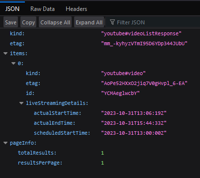
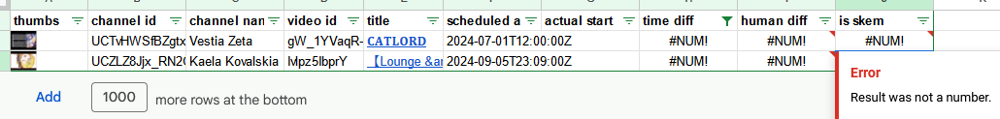
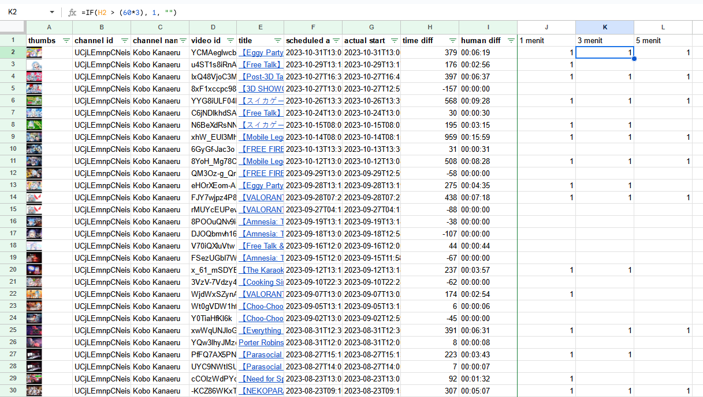
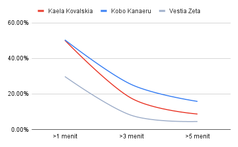
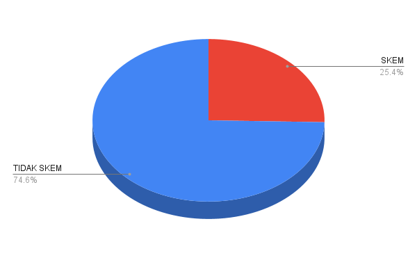
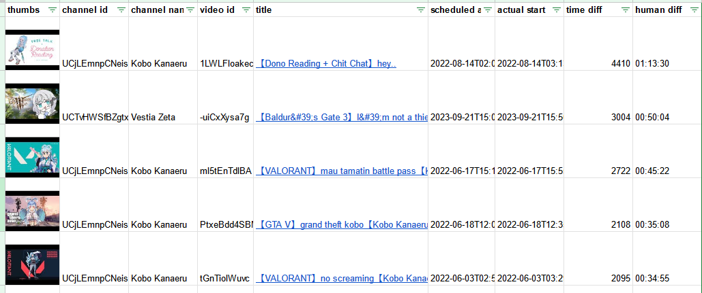

# Kajian Komparasi VTuber Skem - Studi Kasus: HoloH3ro

## Abstrak
Kobo Kanaeru[^1] (Kobo) merupakan salah satu VTuber Hololive Indonesia generasi ketiga (HoloH3ro) yang terkenal sering meng-"skem" (telat memulai _stream_) para penontonnya. Namun, anime biru ini suka mengelak mengatakan dirinya bukan skemmer. Oleh karena itu, dilakukanlah kajian ini dengan melakukan komparasi data _live streaming_ Kobo dengan _genmates_-nya yaitu Kaela Kovalskia[^2] (Kaela) dan Vestia Zeta[^3] (Zeta) agar bisa didapatkan sebuah kesimpulan yang berdasarkan data empiris yang dapat dipertanggung jawabkan. Dari data yang ada, diketahui Kobo menduduki peringkat pertama sebagai skemmer dengan tingkat skem 25.37% (dengan tingkat toleransi keterlambatan yaitu 3 menit dari skejul stream), mengalahkan Kaela (17.66%) dan Zeta (8.02%).

## 1. Metodologi

Kajian ini menggunakan metode analisa statistika sederhana yaitu dengan membandingkan jumlah _live stream_ yang dinilai skem (berdasarkan batas toleransi tertentu) dengan total _live stream_ yang pernah dilakukan.

Sebagai contoh, kita dapat menentukan suatu _live stream_ dikatakan skem jika telat lebih dari 5 menit dari jadwal yang seharusnya (di jadwal, katanya mulai jam 20.00, tapi baru mulai jam 20.08, SKEM).

## 2. Data dan Limitasi

Untuk mendapatkan data _live stream_, Penulis memanfaatkan API public dari YouTube[^4] yang berisikan data `scheduledStartTime` dan `actualStartTime`. Penulis juga membuat _script_ untuk melakukan _indexing_ daftar _live stream_ dari masing-masing VTuber yang akan dikaji.



berikut pseudocode dari _script_ yang dibuat

```js 
FOR each vtuber
    CALL getVideos with vtuber RETURNING videos
    FOR each videos
        CALL getVideoDetails with video RETURNING detail
        IF detail have "liveStreamingDetails" property
            CALL appendRow with detail
        ENDIF
    ENDFOR
ENDFOR
```

output dari _script_ tersebut berupa data dengan kolom/fitur, antara lain:
- `channel_id`
- `channel_name`
- `video_id`
- `title`
- `scheduled_at`
- `actual_start`
- `diff_time` (dalam satuan detik)

Kajian ini hanya akan menghitung _live stream_ publik dan waktu _stream_ dimulai sesuai dengan data yang didapatkan dari API, sehingga jeda waktu antara _loading screen_ sampai dengan interaksi pertama _streamer_ akan diabaikan.

## 3. Pembersihan Data

Karena memang datanya sederhana (banget) dan sedikit, Penulis menggunakan Google Sheet untuk melakukan pengecekan dan pengolahan data. Untuk kasus ini, ditemukan ada 2 baris data yang _invalid_ dengan error `#NUM!` dikarenakan merupakan sebuah _live stream "placeholder"_ (id `38fJIy2FoDg` dan `1WhsM61BUfk`) sehingga tidak memiliki `actualStartTime`



Kedua baris tersebut dapat dihapus karena tidak dapat digunakan dalam perhitungan.

## 4. Pelabelan Data

Dalam melakukan pelabelan data, Penulis mencoba menggunakan 3 tingkat toleransi keterlambatan, yaitu 1 menit, 3 menit, dan 5 menit.



## 5. Analisa Data

> ### analisa menggunakan script dapat dilihat di [Kaggle - holosk3m](https://www.kaggle.com/code/arashari/holosk3m)

Dari 1204 data _live stream_ yang dimiliki, diketahui jumlah _live stream_ dengan kategori skem sebagai berikut:

| | Kobo Kanaeru | Kaela Kovalskia | Vestia Zeta |
| --- | --- | --- | --- |
| **>1 menit** | 169 | 236 | 119 |
| **>3 menit** | 85 | 83 | 32 |
| **>5 menit** | 53 | 41 | 18 |
| **_# live stream_** | **335** | **470** | **399** |

yang jika kita hitung dalam bentuk persen dibandingkan dengan total _live stream_ dari masing-masing VTuber adalah sebagai berikut:

| | Kobo Kanaeru | Kaela Kovalskia | Vestia Zeta |
| --- | --- | --- | --- |
| **>1 menit** | 50.45% | 50.21% | 29.82% |
| **>3 menit** | 25.37% | 17.66% | 8.02% |
| **>5 menit** | 15.82% | 8.72% | 4.51% |



dari chart di atas, terlihat titik optimal terjadi pada label `>3 menit`

Agar lebih jelas, berikut visualisasi proporsi Kobo melakukan skem kepada _viewers_-nya



Selain itu, jika kita urutkan data berdasarkan durasi skem terlama, didapatkan 5 posisi teratas sebagai berikut



Terlihat Kobo kembali merajai dengan skem terlama selama `1 jam 13 menit 30 detik` dan meng-_!claim_ `4 dari 5 posisi teratas`

## 5. Kesimpulan

Berdasarkan data di atas, diketahui Kobo merupakan VTuber paling skem di antara _genmates_-nya.

## 6. Saran dan Perbaikan

Menambah lebih banyak data dengan mencoba melakukan komparasi dengan VTuber lain untuk mencari batas skem yang normal.

## 7. Lampiran

- [data](./holosk3m.csv) - _updated 2023/11/05_
- [script](./script.gs)

[^1]: https://www.youtube.com/@KoboKanaeru
[^2]: https://www.youtube.com/@KaelaKovalskia
[^3]: https://www.youtube.com/@VestiaZeta
[^4]: https://developers.google.com/youtube/v3/docs/videos/list
